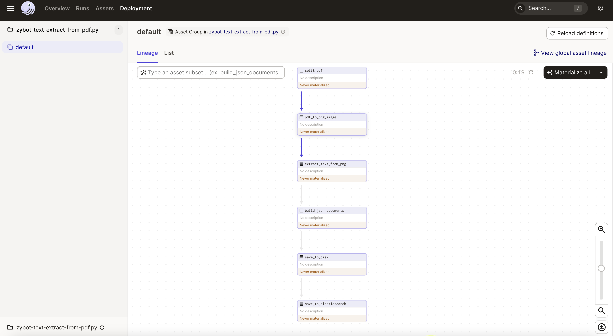
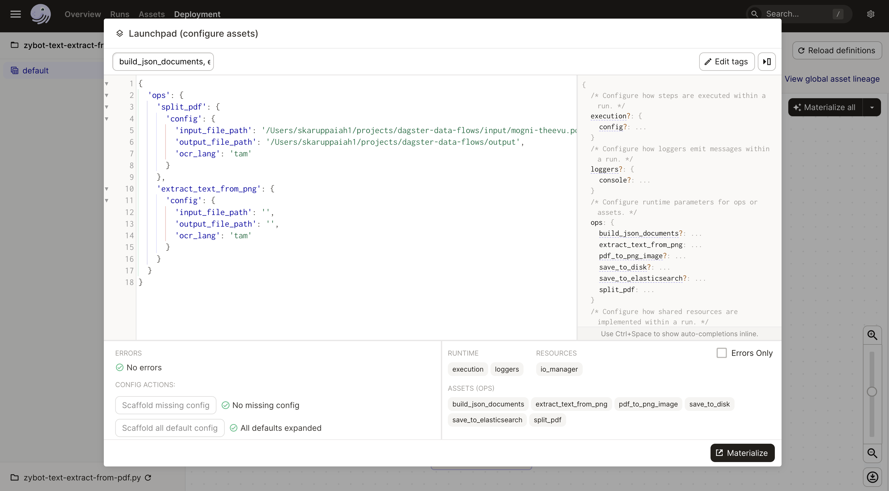
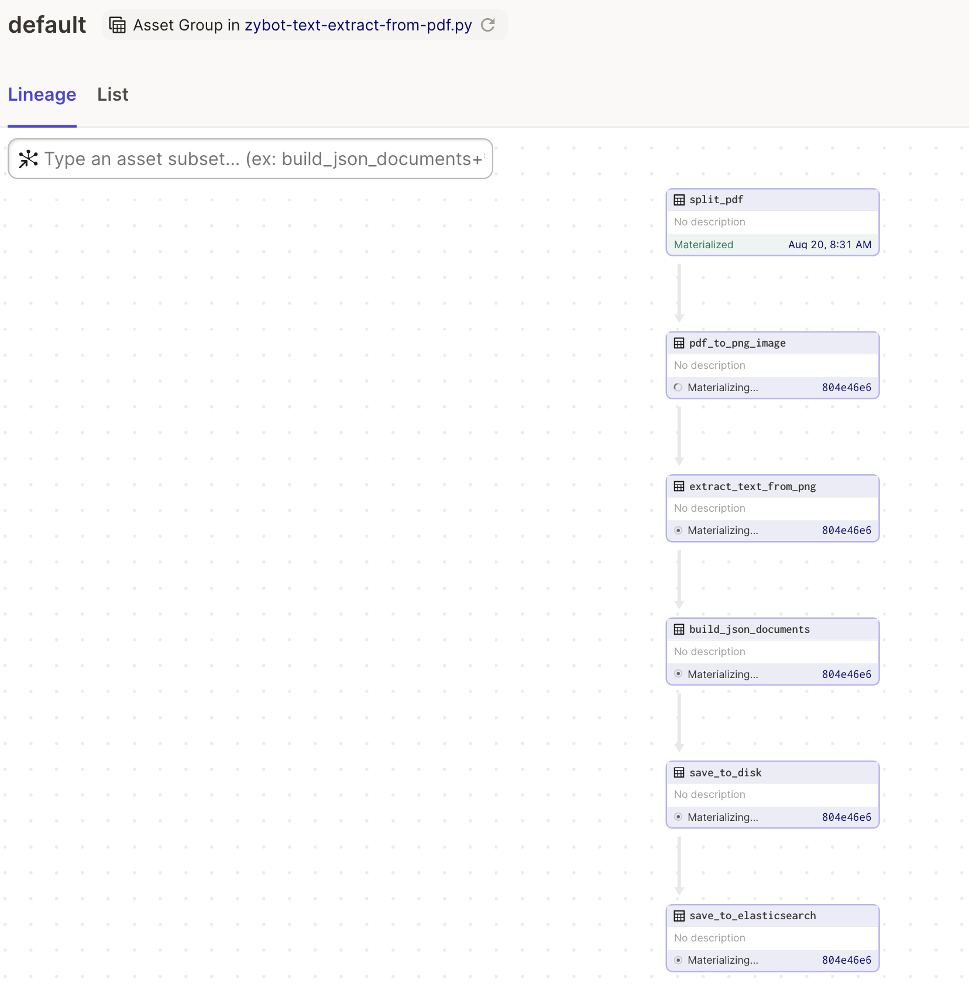
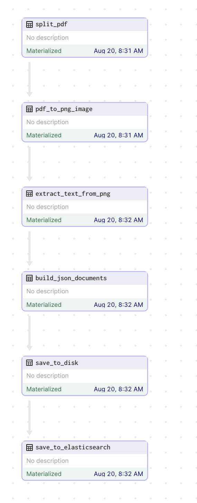
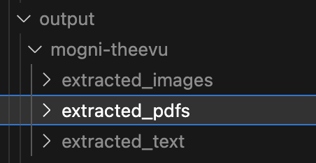
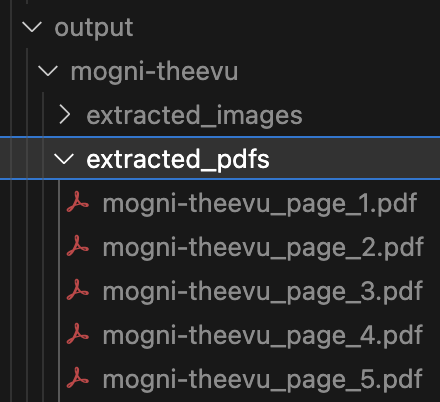
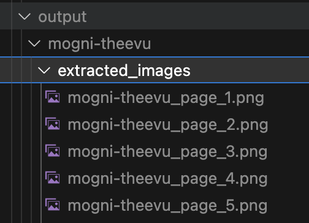
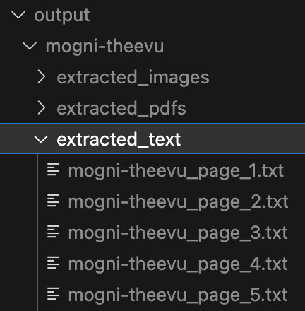

# dagster-data-flows
Explore captivating data pipelines and workflow solutions using Dagster. This repository showcases a collection of diverse and engaging use cases, demonstrating the power and versatility of Dagster in managing, orchestrating, and optimizing data flows. Join us on this journey of discovery and innovation in data engineering and workflow automation.


## Python Environment Setup and activation


```bash
python3 -m venv env
```

```bash
source env/bin/activate
```

### Install dependencies

```bash
pip install -r requirements.txt
```

## Run the pipeline locally

```bash
dagster dev -f ./zybot-text-extract-from-pdf.py 
```

This will open up a dagit instance in your browser http://localhost:3000.



You can then run the pipeline by clicking on the `Materialize All` button. or  Materialize one by one by clicking on the `Launch Execution` button. 
Once you click on the `Launch Execution` button, you will be presented with the following screen to enter the input config params. Copy and paste the below. If the validation is successful, you will be able to see the `Execute` button.

> Note: Please change the input_file_path and output_file_path accordingly. The output file path should be a directory and not a file path. The output file will be named as the input file name with the page number appended to it. For example, if the input file name is `Ilaiya-Raani.pdf`, the output file will be named as `Ilaiya-Raani_1.pdf` for the first page, `Ilaiya-Raani_2.pdf` for the second page and so on.

```python
{
  'ops': {
    'split_pdf': {
      'config': {
        'input_file_path': '/Users/skaruppaiah1/projects/dagster-data-flows/input/mogni-theevu.pdf',
        'output_file_path': '/Users/skaruppaiah1/projects/dagster-data-flows/output',
        'ocr_lang': 'tam'
      }
    },
    'extract_text_from_png': {
      'config': {
        'input_file_path': '',
        'output_file_path': '',
        'ocr_lang': 'tam'
      }
    }
  }
}
```



You will see the lineage and the execution process status in the dagit UI.



If all the jobs are successful, you will see the following screen.



Final result files will be available in the `output` directory.







